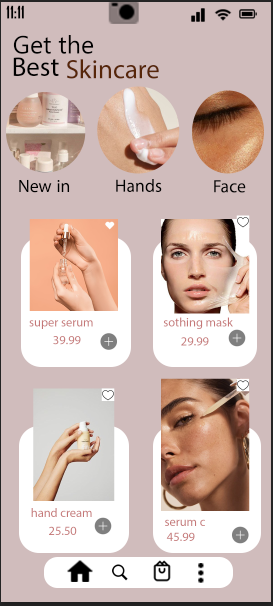
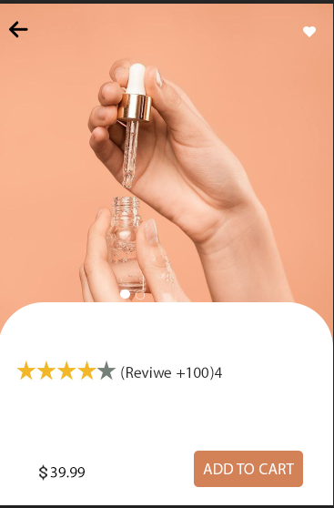

# Skincare Mobile App UI Design

📱 **Overview:**  
This project is a **two-screen mobile app UI design** for a skincare e-commerce application.  
It was created using **Adobe Photoshop** as part of the **Information System course**, focusing on **visual design, layout, and user-friendly navigation**.

🎨 **Tools Used:**  
- Adobe Photoshop  
- UI/UX Design Principles  

📂 **Project Contents:**  
- **Home Screen:** Product showcase with modern layout and easy navigation.  
- **Product Details Screen:** Detailed product information with a clean, minimalistic design.  

✨ **Goal:**  
To design a **simple and appealing interface** that enhances the user experience for skincare product shopping.

---

## 📸 Screenshots

### Home Screen

### Product Details Screen

